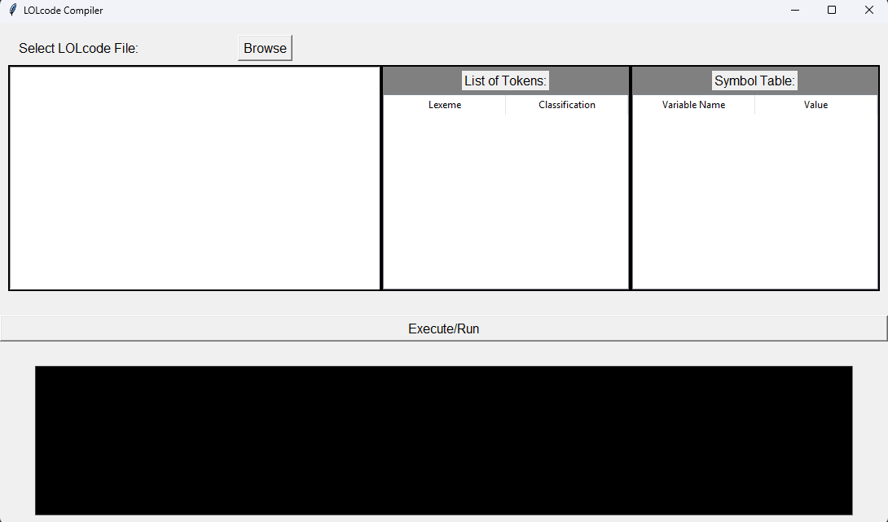

# LOLCODE Interpreter

An interpreter for the LOLCODE Programming Language using Python Programming Language.

---

## FEATURES
1. Analyze the LOLCode **Lexically**
2. Analyze the LOLCode **Syntactically**
3. Analyze the LOLCode **Semantically**

## INSTALLATION GUIDE
1. Install Python 3+ in your OS.
2. Install TKinter if it is not installed.
    - Windows:
        - Check if TKinter is installed

        - Reinstall python with TKinter support
            - **https://www.python.org/**
    - Linux:
        - Check if TKinter is installed. Run this command in your terminal:
            - **python3 -m tkinter**
        - Install TKinter on Ubuntu:
            - **sudo apt-get install python3-tk**
        - Verify installation:
            - **python3 -m tkinter**
    - macOS:
        - Check if TKinter is installed
            - **python3 -m tkinter**
        - Use Homebrew to install Python:
            - **brew install python**
3. Download the HackNLOL_ST4L.zip file and unzip the file.

## HOW TO RUN
1. Open *main.py*
2. Run *main.py*
3. Use the program

## PROGRAM NAVIGATION

1. **Browse**: Opens file explorer which allows you to pick a .lol file to be interpreted
2. **List of Tokens**: Provides all tokens collected after running the Lexical Analyzer
3. **Symbol Table**: Provides all variable identifiers and their corresponding values
4. **Text Editor**: Displays a preview of what is inside the selected .lol file
5. **Execute/Run**: This button will run the Lexical, Syntax, and Semantic Analyzer
6. **Console**: The result/s and error/s of the LOLCode (if there are any) are displayed here

## HOW TO RUN THE PROGRAM
1. Click on **Browse** button and select a .lol file
2. Press **Execute/Run** to run the program with the selected .lol file